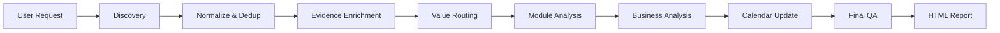
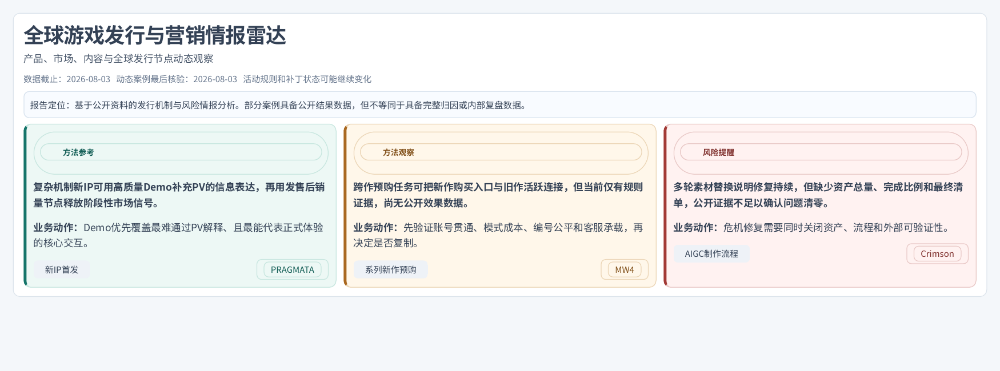
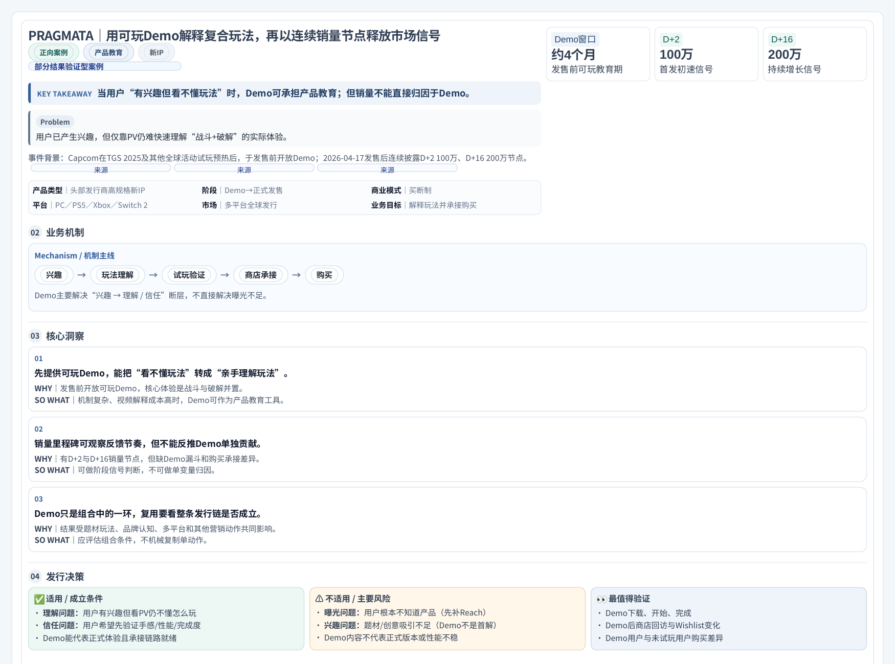
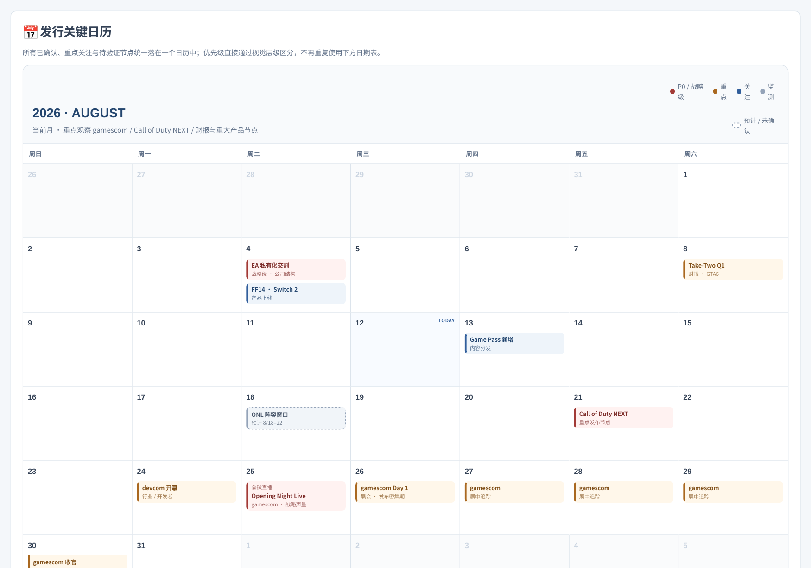

<div align="center">

# 🎮 Game Publishing Intelligence Skill

### Event-driven intelligence for global game publishing & marketing

**Turn public market signals into evidence-bounded publishing decisions.**

`Event` → `Evidence` → `Business Problem` → `Mechanism` → `Decision` → `Monitoring`


</div>

---

## ✨ What is this?

这是一个面向**海外发行 / 市场中台 / 营销 / PR / 本地化**团队的事件驱动游戏情报 Skill。

它不是“新闻总结器”。

它会把分散的：

**官方公告 + 商店变化 + 公开数据 + 玩家讨论 + 媒体报道 + 后续进展**

还原成一个完整 **Event**，再回答：

| 核心问题 | Skill 要回答什么 |
|---|---|
| **What happened?** | 到底发生了什么变化 |
| **Why now?** | 为什么现在值得发行关注 |
| **Business Problem** | 它在解决哪一个发行问题 |
| **Mechanism** | 核心机制如何工作 |
| **Evidence** | 当前证据支持到哪里 |
| **Decision** | 什么能参考、什么不能照搬 |
| **Monitoring** | 什么新证据会改变结论 |

> **核心原则：不是帮你搜更多新闻，而是帮你判断这条信息对发行到底意味着什么。**

---

## 🧠 How it works



默认执行模式：

```text
full_pipeline
```

当用户说“扫描最近 7 天”“跑一下 Skill”“生成一期情报”时，默认一路执行到**实际生成 HTML 报告**。

---

## 🔍 Why it is different

### 01 — Event-first, not feed-first

单条帖子、PV、新闻都只是证据。

真正的分析单位是：

> **Event**

同一事件中的官方公告、商店变化、媒体报道、玩家讨论、公开数据和后续回应，会尽量被聚合到同一事件链。

---

### 02 — Evidence-bounded reasoning

Skill 强制区分：

| 类型 | 含义 |
|---|---|
| ✅ 已确认事实 | 官方已公布 / 可核验 |
| 💬 玩家公开表达 | 玩家“说了什么” |
| 🧩 机制分析 | 报告对规则/结构的分析 |
| 📈 结果信号 | 已出现结果，但未必可归因 |
| ❓ 待验证假设 | 需要后续证据确认 |

#### Hard Rules

> **规则存在 ≠ 效果发生**  
> **播放量高 ≠ 发行成功**  
> **玩家表达 ≠ 玩家真实心理**  
> **结果出现 ≠ 单一动作可归因**  
> **单平台声音 ≠ 全球玩家态度**

---

### 03 — Product coordinates before analysis

重点案例必须先确认：

`产品` · `开发/发行` · `品类` · `商业模式` · `生命周期` · `市场` · `平台` · `目标用户` · `业务目标`

缺失信息显式标记：

```text
confirmed
partially_confirmed
inferred
unknown
not_applicable
```

---

### 04 — Full release path

重点案例按适用性回溯：

```text
首次公开
→ 商店页 / Wishlist
→ 媒体 / 线下试玩
→ 测试
→ Demo
→ Early Access
→ 预购
→ 正式发售
→ 首轮结果
→ 里程碑
→ 后续更新 / 回应
```

---

### 05 — Business reasoning, not summary

最终案例必须回答：

> **Problem → Mechanism → WHY → SO WHAT → Conditions → Risks → Validation**

如果最后只能写出：

> “加强、提升、重视、优化”

那这条洞察应该被重写或删除。

---

## 📦 Output

| 🚨 P0 Flash | 📊 Intelligence Report |
|---|---|
| 重大政策 / 平台规则 | 首页优先结论 |
| 重大产品节点 | 重点案例 |
| 重大舆情 / 风险 | 短事件卡 |
| Convention 重大官宣 | Radar / 持续监测 |
| 跨平台危机 | Calendar / 来源 / Run Log |

> **3–5 个案例只是常规参考，不是硬门槛。**  
> 至少 1 个正式事件通过证据与业务价值闸门即可生成报告。

---

## 🎨 Visualization-first

默认视觉优先级：

> **结论 → 机制 → 关键数据 → 证据**

| 情况 | 优先表达 |
|---|---|
| 时间过程 | Timeline |
| 机制链 | Flow / Arrow Chain |
| 版本变化 | Before / After |
| Campaign / 创意 | Asset Matrix |
| 多市场 / 多平台 | Region × Platform Matrix |
| 结果数据 | 1–3 Key Metrics |
| 洞察 | Judgement / WHY / SO WHAT |
| 未来节点 | Large Calendar |

### Calendar V2

一个**全宽大日历**承载所有关键日期：

🔴 **P0 / 战略级** · 🟠 **重点** · 🔵 **关注** · ⚪ **监测** · 虚线 = **预计 / 未确认**

不再使用“小日历 + 下方重复日期表”。

---


## 🖥 Example Output

### Report overview



### Case mechanism & business judgment



### Calendar V2



> Screenshots are generated from the current HTML intelligence report template. The report is designed around **Conclusion → Mechanism → Key Data → Evidence**.

---

## 🧪 Golden Examples

| Case | Pattern | Key boundary |
|---|---|---|
| **PRAGMATA** | Demo as Product Education | 销量不能直接归因于 Demo |
| **Modern Warfare 4** | Cross-title Lifecycle Migration | 模式迁移 ≠ 整体 DAU 增长 |
| **Crimson Desert** | Risk Closure | 补丁上线 ≠ 风险事件关闭 |

---

## 🛡️ Quality Gate

任何重点案例缺少以下任一项，直接 FAIL：

- [ ] 产品坐标
- [ ] 地区与平台
- [ ] 完整链路
- [ ] 案例专属机制
- [ ] 证据边界

同时检查：

- [ ] 是否把相关性写成因果
- [ ] 是否把规则写成效果
- [ ] 是否把单平台反馈外推为全球
- [ ] 是否混淆 Demo / Beta / Early Access
- [ ] 是否把上架写成商业合作
- [ ] 是否重复旧事件
- [ ] 是否存在无依据“显著提升 / 行业领先”
- [ ] 是否有下一监测节点
- [ ] 是否有真正的信息可视化

---

## 🚀 Quick Start

```text
使用 Game Publishing Intelligence Skill。

扫描最近 7 天全球游戏行业，
寻找真正值得海外发行市场中台关注的事件。

默认使用 full_pipeline。
不因为播放量高就收录。
不凑案例。
证据不足只标记待验证。

通过 Final QA 后生成单文件 HTML。
```

---

## 🗂 Repository

```text
.
├── SKILL.md
├── QUICK_START.md
├── VISUAL_DESIGN_RULES.md
├── CHANGELOG.md
├── config/
├── prompts/
├── schemas/
├── examples/
├── templates/
├── tests/
├── state/
└── outputs/
```

<details>
<summary><strong>展开核心模块</strong></summary>

- `orchestrator.md` — 主调度
- `discovery.md` — 候选事件发现
- `normalize_dedup.md` — 归一化 / 跨期去重
- `evidence_enrichment.md` — 证据补全
- `business_analysis.md` — 业务分析
- `player_voice.md` — 玩家反馈
- `crisis_deep_dive.md` — 舆情 / 风险
- `policy_analysis.md` — 政策 / 平台规则
- `convention_analysis.md` — Convention
- `asset_campaign_analysis.md` — Campaign / Asset
- `calendar_update.md` — Calendar
- `final_qa.md` — 最终质量闸门
- `report_compose.md` — HTML Report

</details>

---

## 🛠 Platform

当前设计为平台无关的 **Agent-ready workflow package**。

优先适配：

- **Codex**
- **WorkBuddy**

也可以继续封装到支持：

`Web Search` · `MCP` · `Connector` · `Workflow` · `Agent`

> 当前版本属于主动调用型 Beta，不是已经完成数据库、定时任务和后台服务的完整软件平台。

---

## 🗺 Roadmap

### V0.2

- [ ] Evidence Model V2
- [ ] Fact / Mechanism / Outcome / Attribution 分层
- [ ] Case Library
- [ ] Pattern Library
- [ ] 5–10 个新案例 Beta
- [ ] 更严格的 Taxonomy / Schema
- [ ] 历史运行对比

### Later

- [ ] Scheduled Monitoring
- [ ] Automated P0 Alerts
- [ ] Persistent Case Database
- [ ] Multi-market Source Adapters
- [ ] Team Collaboration Workflow

---

<div align="center">

## V0.1.2 Beta

**Agent-ready workflow / Skill specification**

_Not yet a fully engineered automated intelligence platform._

> **好的情报不是“我分析完了”，而是：什么新证据会让我改变判断？**

</div>
